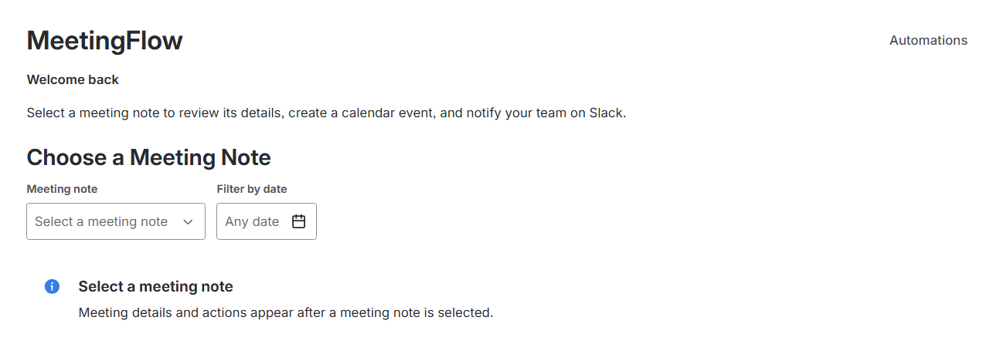
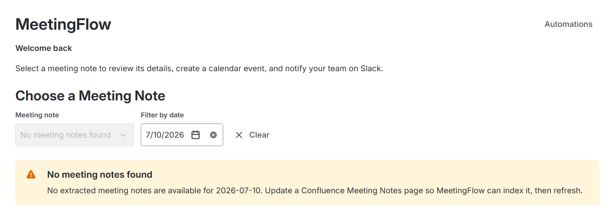
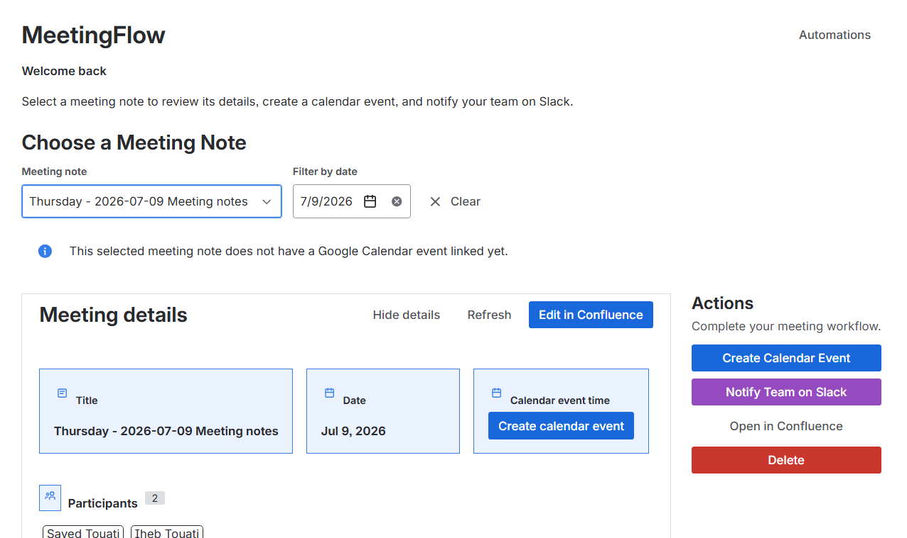
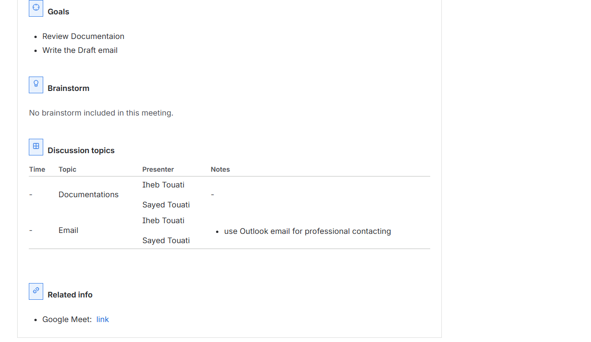
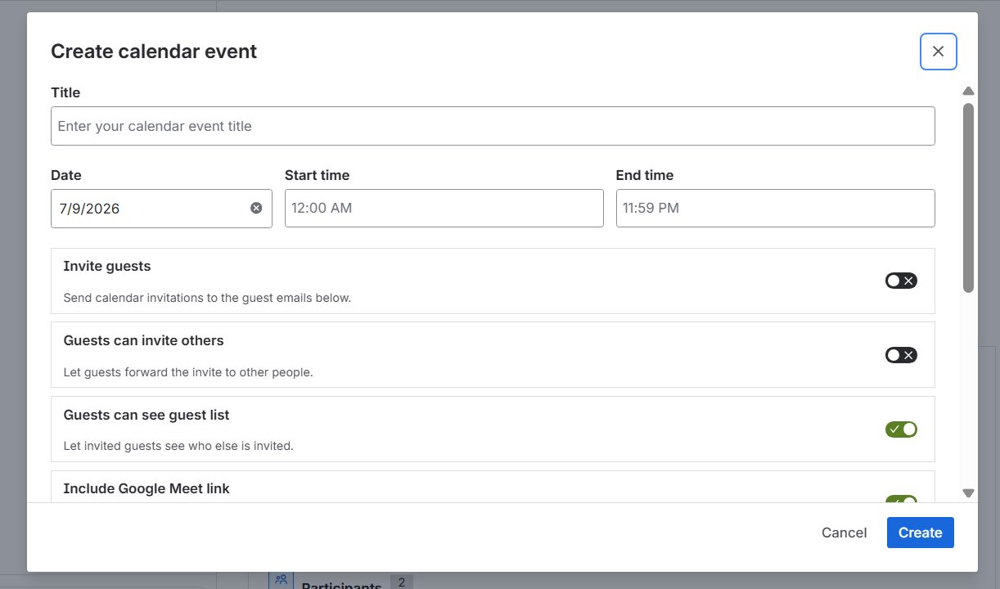
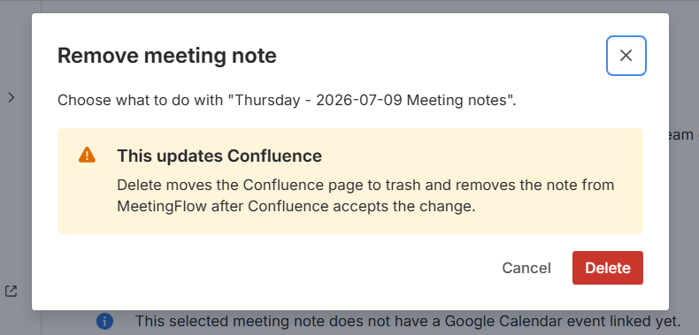
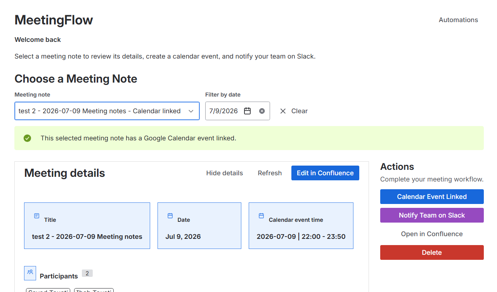
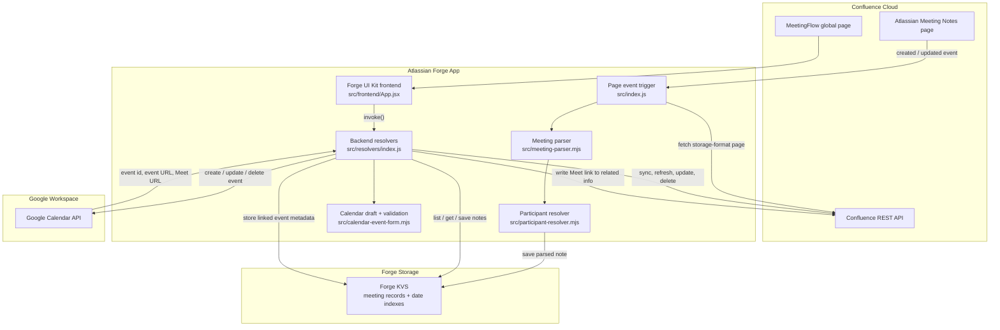

# MeetingFlow

MeetingFlow is an Atlassian Forge app for Confluence that turns Atlassian Meeting Notes pages into structured meeting follow-up workflows.

It indexes Confluence meeting notes, extracts useful meeting data, gives users a MeetingFlow global page inside Confluence, and helps create or update one linked Google Calendar event per meeting note.

## Screenshot

### Empty Meeting Selection



### No Notes For Selected Date



### Meeting note Details Part 1/2



### Meeting note Details Part 2/2



### Create Calendar Event Part 1/2



### Delete Meeting Note



### Linked Calendar Event



## About

MeetingFlow is built for teams that already use Confluence Meeting Notes but still repeat the same follow-up work after every meeting:

- Finding the right meeting note.
- Copying meeting details into calendar invites.
- Adding guests and meeting links manually.
- Checking whether a calendar event already exists.
- Keeping Confluence notes and calendar events connected.
- Cleaning up notes and future events when a meeting is removed.

The app uses Confluence page events to keep a local Forge KVS index of Meeting Notes pages. The global page then gives users a focused workspace to review meeting details, refresh notes from Confluence, and manage Google Calendar events from the extracted content.

Current scope: Confluence Meeting Notes plus Google Calendar event management. Slack notification UI is present as planned functionality, but Slack delivery is not implemented yet.

## Why MeetingFlow?

Meeting follow-up is often spread across disconnected tools. A meeting starts in Confluence, but the calendar event, guest list, Meet link, related resources, and team notifications live somewhere else.

MeetingFlow reduces that manual handoff by treating the Confluence Meeting Notes page as the source of truth. It extracts the content teams already write and uses it to power downstream actions, starting with Google Calendar.

The MVP focuses on the highest-friction path:

1. Find the meeting note.
2. Verify parsed details.
3. Create a calendar event.
4. Keep one event linked to one note.
5. Update or delete that linked event safely.

## Features

### Meeting Note Indexing

- Listens for Confluence page created and updated events.
- Detects Atlassian Meeting Notes pages by template entity ID.
- Fetches Confluence pages in storage format.
- Parses title, date, time, participants, goals, brainstorm notes, discussion topics, related info.
- Resolves Confluence user mentions into readable display names.
- Stores full meeting records and lightweight date indexes in Forge KVS.

### MeetingFlow Global Page

- Adds a Confluence global page titled `MeetingFlow`.
- Lists indexed meeting notes.
- Filters meeting notes by date.
- Shows whether the selected note has a linked calendar event.
- Displays meeting details in a structured UI.
- Opens the source Confluence page.
- Opens the source Confluence page in edit mode.
- Refreshes the selected meeting note directly from Confluence.

### Google Calendar Event Management

- Creates Google Calendar events from parsed meeting note data.
- Builds event descriptions from meeting goals, discussion topics, and related info.
- Supports editable title, date, start time, end time, guests, guest permissions, and Google Meet creation.
- Stores linked calendar event metadata on the meeting record.
- Prevents duplicating calendar events for the same meeting note.
- Opens update mode when a future linked calendar event already exists.
- Updates the linked event through the Google Calendar API.
- Writes generated Google Meet links back to the Confluence meeting note related info section when possible.

### Meeting Removal

- Deletes a meeting note from Confluence and removes it from Forge KVS.
- Can delete a future linked Google Calendar event together with the note.
- Blocks linked calendar event deletion after the event has started.
- Supports archiving meeting notes through a backend resolver.

### Automation Settings

- Stores automation settings in Forge KVS.
- Computes Google Calendar readiness for each note.
- Shows review status when required calendar fields are missing.
- Includes a Slack automation toggle as a placeholder for future Slack support.

## Architecture Diagram



## Architecture Overview

MeetingFlow has two main runtime paths.

### 1. Event Indexing Path

```text
Confluence page event
  -> src/index.js
  -> Confluence page storage fetch
  -> src/meeting-parser.mjs
  -> src/participant-resolver.mjs
  -> src/automation-settings.mjs
  -> src/meeting-storage.mjs
  -> Forge KVS
```

This path runs when Confluence sends page created or updated events. It filters to Meeting Notes pages, parses the page, enriches participants, computes automation readiness, and stores the result.

### 2. User Workflow Path

```text
MeetingFlow global page
  -> src/frontend/App.jsx
  -> @forge/bridge invoke()
  -> src/resolvers/index.js
  -> Forge KVS / Confluence REST API / Google Calendar API
```

This path runs when users interact with the MeetingFlow UI. It powers note listing, date filtering, note refresh, Google Calendar create/update/delete, Confluence delete/archive, and automation settings.

## Tech Stack

- Atlassian Forge
- Forge UI Kit with `@forge/react`
- Forge Bridge with `@forge/bridge`
- Forge Resolver with `@forge/resolver`
- Forge KVS with `@forge/kvs`
- Forge API with `@forge/api`
- Google Calendar API
- Confluence REST API
- Node.js 22.x Forge runtime
- Node.js built-in test runner
- ESLint
- `htmlparser2` for Confluence storage parsing
- `entities` for HTML entity decoding

## Project Structure

```text
.
|-- docs/
|   |-- milestone_1.md
|   |-- milestone_2.md
|   |-- milestone_3.md
|   |-- milestone_4.md
|   |-- milestone_5.md
|   |-- milestone_6.md
|   |-- milestone_7.md
|   |-- milestone_8.md
|   |-- milestone_9.md
|   `-- superpowers/
|       `-- specs/
|           `-- 2026-07-07-google-calendar-event-design.md
|-- src/
|   |-- frontend/
|   |   |-- components/
|   |   |   |-- AppHeader.jsx
|   |   |   |-- AutomationSettingsDrawer.jsx
|   |   |   |-- CreateCalendarEventModal.jsx
|   |   |   |-- DeleteMeetingModal.jsx
|   |   |   |-- MeetingActions.jsx
|   |   |   |-- MeetingDetailsSection.jsx
|   |   |   |-- MeetingField.jsx
|   |   |   |-- MeetingInfoCard.jsx
|   |   |   `-- MeetingSelector.jsx
|   |   |-- App.jsx
|   |   |-- index.jsx
|   |   |-- meeting-editing.mjs
|   |   `-- message-timing.mjs
|   |-- resolvers/
|   |   `-- index.js
|   |-- automation-settings.mjs
|   |-- calendar-event-form.mjs
|   |-- google-calendar-event.mjs
|   |-- index.js
|   |-- meeting-confluence-removal.mjs
|   |-- meeting-confluence-update.mjs
|   |-- meeting-note-sync.mjs
|   |-- meeting-notes-template.mjs
|   |-- meeting-parser.mjs
|   |-- meeting-storage.mjs
|   `-- participant-resolver.mjs
|-- test/
|   |-- automation-settings.test.mjs
|   |-- calendar-event-form.test.mjs
|   |-- forge-ui-kit-components.test.mjs
|   |-- google-calendar-event.test.mjs
|   |-- meeting-confluence-removal.test.mjs
|   |-- meeting-confluence-update.test.mjs
|   |-- meeting-editing.test.mjs
|   |-- meeting-note-sync.test.mjs
|   |-- meeting-parser.test.mjs
|   |-- meeting-storage.test.mjs
|   `-- message-timing.test.mjs
|-- AGENTS.md
|-- MeetingFlow_Project.md
|-- manifest.yml
|-- package.json
|-- package-lock.json
`-- README.md
```

### Important Files

- `manifest.yml`: Forge app modules, runtime, OAuth provider, remotes, and permissions.
- `src/index.js`: Confluence page event trigger handler.
- `src/frontend/App.jsx`: Main MeetingFlow UI state and workflow orchestration.
- `src/resolvers/index.js`: Backend resolver functions called from the UI.
- `src/meeting-parser.mjs`: Confluence storage parser.
- `src/meeting-storage.mjs`: Forge KVS record, index, and calendar metadata helpers.
- `src/calendar-event-form.mjs`: Calendar draft, validation, and description helpers.
- `src/google-calendar-event.mjs`: Google Calendar payload and response helpers.

## Installation

Install project dependencies:

```powershell
npm install
```

Validate the app:

```powershell
npm test
npm run lint
forge lint
```

Deploy to the Forge development environment:

```powershell
forge deploy --non-interactive --e development
```

Install the app on a Confluence site:

```powershell
forge install --non-interactive --site <site-url> --product confluence --environment development
```

Upgrade an existing installation after changing scopes, modules, providers, or egress permissions:

```powershell
forge install --non-interactive --upgrade --site <site-url> --product confluence --environment development
```

View recent development logs:

```powershell
forge logs -e development --since 15m
```

## Configuration

### Forge App

The app is configured in `manifest.yml`.

Current Forge modules:

```text
confluence:globalPage
trigger
function
```

Current runtime:

```text
nodejs22.x
```

### Google OAuth Provider

The Google provider is configured in `manifest.yml` under `providers.auth`.

Provider key:

```text
google
```

Remote key:

```text
google-apis
```

Calendar scope:

```text
https://www.googleapis.com/auth/calendar.events
```

OAuth endpoints:

```text
https://accounts.google.com/o/oauth2/v2/auth
https://oauth2.googleapis.com/token
https://oauth2.googleapis.com/revoke
```

### Forge KVS Keys

MeetingFlow stores these app-level records:

```text
automation-settings
meeting-note:<pageId>
meeting-note-index:all
meeting-note-index:<YYYY-MM-DD>
```

## Usage

### Index Meeting Notes

Create or update an Atlassian Meeting Notes page in Confluence. MeetingFlow receives the Confluence page event, verifies the page template, parses the page content, and stores the meeting record in Forge KVS.

### Open MeetingFlow

Open the MeetingFlow global page in Confluence. The app loads indexed meeting notes and refreshes recent Confluence Meeting Notes through the resolver-backed sync flow.

### Filter And Select A Meeting

Use the date filter to narrow the meeting list. Select a meeting note to view extracted details such as:

- Title
- Date
- Calendar event time
- Participants
- Goals
- Brainstorm notes
- Discussion topics
- Related info

### Create A Calendar Event

Select a meeting note and choose `Create Calendar Event`.

The modal lets users review and edit:

- Event title
- Date
- Start and end time
- Guest list
- Guest invitation behavior
- Google Meet creation
- Calendar description preview

After creation, MeetingFlow stores the Google event metadata and, when a Meet link is returned, attempts to update the Confluence meeting note related info section.

### Update A Linked Calendar Event

If a selected meeting note already has a future linked calendar event, MeetingFlow opens update mode instead of creating a duplicate event.

Started events are treated as locked for update/delete behavior.

### Delete A Meeting Note

Use the delete action to remove a meeting note from Confluence and MeetingFlow storage.

If the note has a future linked Google Calendar event, MeetingFlow can delete the note and linked event together. If the event has already started, MeetingFlow blocks calendar event deletion and asks the user to delete only the note.

## API Integrations

### Confluence REST API

MeetingFlow uses Confluence APIs to:

- Fetch page storage content.
- Search recent pages.
- Resolve Confluence users.
- Update meeting note storage content.
- Archive meeting note pages.
- Delete meeting note pages.

The code uses both `api.asApp()` and `api.asUser()` depending on context. User-driven resolver operations generally use `api.asUser()`.

### Google Calendar API

MeetingFlow uses the Google Calendar API to:

- Create calendar events.
- Update linked calendar events.
- Delete future linked calendar events.
- Request Google Meet conference data.
- Extract Google Calendar and Meet links from API responses.

Google Calendar requests are made from backend resolvers with Forge provider auth:

```js
api.asUser().withProvider("google", "google-apis")
```

## Security

- Forge app permissions are declared explicitly in `manifest.yml`.
- Google Calendar access uses Forge OAuth 2.0 provider auth.
- Google Calendar operations run as the connected user.
- Product API operations in user workflows prefer `api.asUser()`.
- Forge KVS is used for app-owned meeting records and indexes.
- Calendar duplicate prevention is enforced by checking stored linked event metadata before creation.
- Linked event deletion is blocked after the event start time.
- External backend fetch permissions are limited to Google API and OAuth endpoints.

Current Forge scopes:

```text
read:confluence-content.summary
read:confluence-user
read:page:confluence
search:confluence
storage:app
delete:page:confluence
write:confluence-content
write:page:confluence
```

## Roadmap

- Add real Slack notification delivery.
- Turn Google Calendar readiness into safe automatic event creation.
- Add clearer admin controls for automation behavior.
- Add richer processing and audit status for indexed notes.
- Improve recovery when Google Calendar succeeds but Confluence update fails.
- Add repair tools for stale linked calendar metadata.
- Add screenshots from the deployed Forge app.

## Contributing

This app is built for a single-customer Forge deployment, but contributions should still follow production-quality standards.

Before opening or merging changes:

```powershell
npm test
npm run lint
forge lint
```

Development guidelines:

- Keep changes small and focused.
- Use UI Kit components from `@forge/react`.
- Do not use raw HTML elements in Forge UI Kit views.
- Use `DynamicTable` instead of a non-existent `Table` component.
- Add focused tests for parser, storage, resolver, security, and regression-prone behavior.
- Keep manifest scopes minimal.
- Redeploy and upgrade the installation after manifest permission, provider, module, or egress changes.

## License

MIT. See the `license` field in `package.json`.

## Author

Sayed Touati

GitHub: [Sayed-Touati](https://github.com/Sayed-Touati)
